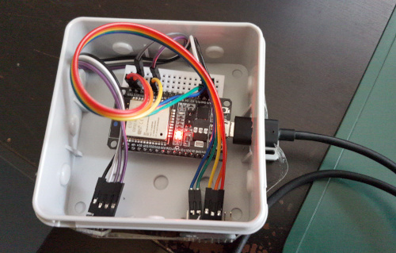

# ESP32 meteo Node

This folder contains source code for a `ESP32` based node. The node is connected to the Wifi and periodically pusblishes it's data via MQTT.

The Arduino Sketchbook for the `meteo-node` is [meteo-esp32.ino](meteo-esp32.ino).

## Requirements

* [PubSubClient](https://www.arduinolibraries.info/libraries/pub-sub-client)
* [BME280](https://www.arduinolibraries.info/libraries/bme280)
* Webserver

The recommended way is to download the required libraries via the Arduino IDE

## Configuration

You need to modify at least the WIFI password and the MQTT server. IF you are planning to setup multiple nodes, configure `NODE_ID` and `NODE_NAME` accordingly

    [...]
    
    // TODO: Set your Wifi SSID and password
    
    #define WIFI_SSID ""
    #define WIFI_PASSWORD ""
    
    // TODO: Configure your node here
    
    #define NODE_ID 0
    #define NODE_NAME "outdoors"
    
    // TODO: Set your MQTT server
    
    #define MQTT_REMOTE "192.168.1.1"
    #define MQTT_PORT 1883
    #define MQTT_CLIENTID "meteo-" NODE_NAME
    
    [...]